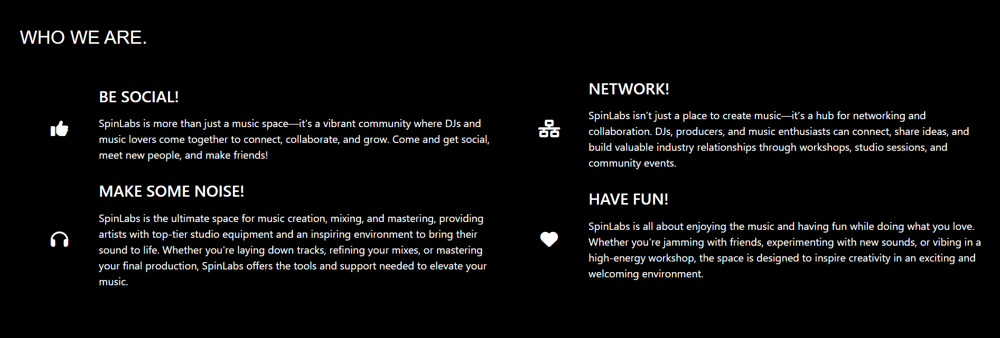
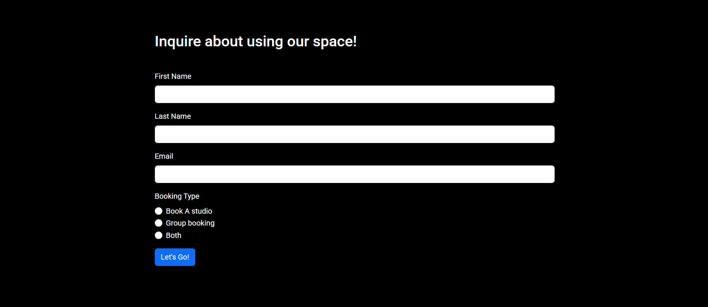
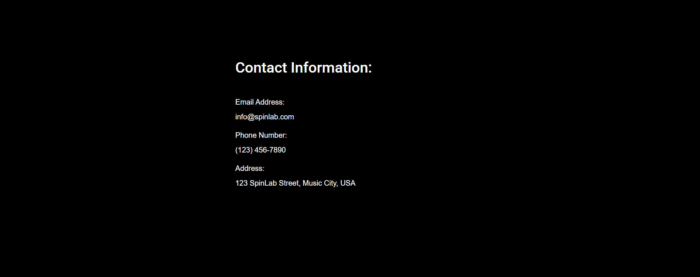

## **Overview**  
Spinlab is a responsive website built using **HTML, CSS, and Bootstrap**. This project is part of the **Code Institute Full Stack Development Course**.  

https://ellerbyluke.github.io/spinlabs-milestone1-/
---

## **Purpose and Value of the Project**  
Spinlab is a fictional **music and DJ space** that offers an engaging and modern online presence for users interested in:  

- **Booking a space** for DJ sessions.  
- **Networking with fellow DJs** and music enthusiasts.  
- **Learning more** about the community and available services.  

### **Value to Users:**  
✅ Provides an **intuitive** and **responsive** user experience.  
✅ Allows users to **easily navigate** through the website.  
✅ Encourages **interaction and engagement** with a booking system.  
✅ Displays **clear contact information** for inquiries.  

---

## **User Experience (UX) Design**  

A user experience designer, **Jesse James Garrett**, introduced five UX design elements in his book *The Elements of User Experience*. This project follows that UX approach.  

### **The Five Planes of UX:**  
1. **Strategy Plane**  
   - The goal is to create a visually appealing, modern, and easy-to-navigate site.  
   - Ensures a seamless user experience for DJs, event organizers, and customers.  

2. **Scope Plane**  
   - The website includes essential features like a **home page, booking form, and contact page**.  

3. **Structure Plane**  
   - The **navigation bar** allows easy switching between pages.  
   - A **clear call-to-action (CTA)** directs users to book a space.  

4. **Skeleton Plane**  
   - The **Bootstrap grid system** is used for layout and responsiveness.  
   - Hover effects and transitions improve user interaction.  

5. **Surface Plane**  
   - The website features a **black and white modern theme**.  
   - Fonts like **Roboto** and **Exo** ensure readability.  

---

## **Wireframes**  
Wireframes were created to **plan the layout** of the website before development. Below is a basic wireframe structure of each page:  

### **Home Page**  
- **Header** (Logo + Navigation)  
- **Main Section** (Introduction & Overview)  
- **Feature Grid** (4 boxes highlighting key aspects)  
- **Footer** (Social Media Links)  


### **Booking Page**  
- **Header** (Navigation)  
- **Booking Form** (User input fields)  
- **Submission Confirmation**  


### **Contact Page**  
- **Header**  
- **Contact Information** (Phone, Email, Address)  
- **Footer**  


---

## **Testing Process**  
During development, multiple debugging techniques were used to ensure functionality and responsiveness.  

### **Common Bugs Found & Fixed:**  
1. **Navigation Bar Responsiveness**  
   - Initially, some elements **overflowed on smaller screens**.  
   - **Fix:** Used **Bootstrap’s grid system** and flex properties.  

2. **Form Alignment Issues**  
   - The booking form fields were **misaligned** on some screen sizes.  
   - **Fix:** Used **Bootstrap columns** for proper alignment.  

3. **Broken Links**  
   - Some social media links **did not open correctly**.  
   - **Fix:** Ensured **valid href attributes** and external link handling.  

---

## **Validation of HTML & CSS Code**  

### **HTML Validation**  
✅ Used **W3C HTML Validator** to check for syntax errors.  
✅ Ensured proper **nesting of elements** and semantic structure.  
✅ Fixed minor **missing alt attributes** on images.  

### **CSS Validation**  
✅ Used **W3C CSS Validator** to check for styling errors.  
✅ Fixed **unnecessary duplicate properties**.  
✅ Ensured **cross-browser compatibility** with proper prefixes.  

---

## **Testing & Deployment**  

### **Manual Testing**  
The website was tested on multiple devices using **Chrome DevTools** for different screen sizes:  

✅ Fully responsive on **mobile, tablet, and desktop**.  
✅ Hover effects and animations work correctly.  
✅ Navigation bar **collapses correctly** on small screens.  
✅ Booking form is **functional and user-friendly**.  

### **Devices Used for Testing:**  
- **iPhone SE, XR, 12 Pro, 14 Pro Max**  
- **Pixel 7, Samsung Galaxy S8+, S20 Ultra**  
- **iPad Mini, iPad Air, iPad Pro**  
- **Surface Pro 7, Surface Duo**  
- **Nest Hub, Nest Hub Max**  

### **Deployment**  
The project was deployed using **GitHub Pages**.  

#### **Steps to Deploy:**  
1. Navigate to your **GitHub Repository**.  
2. Click on **Settings > Pages**.  
3. Select the **main branch** as the source.  
4. Click **Save**, and the site will be deployed.  

---
## **Images of finished project:**

1. Homepage - four paragraphs to explain the different aspects of what the space aims to achieve 
   


2. Booking- a booking form comprising of a first name, last name and email address as well as to radio buttons to select between booking a studio or group booking. 



4. Booking result page - a simple thank you message after form completion 


5. Contact- a simple information page with spinlabs email, phone number and physical address displayed 



6. Header - the spinlabs logo and title and below a navigation bar giving options for the user to navigate to the home page, booking page and contact us page


7. Footer a simple footer with social media links via logo's to github facebook and instagram 


---

## **Future Enhancements**  
- **Email confirmation system** after booking.  
- **Customer reviews section** to improve credibility.  
- **Photo gallery page** showcasing Spinlab events.  

---

## **Repository and Development Process**  

### **Cloning the Repository**  
To create a local copy of this project:  
1. Click the **"Code"** button in GitHub.  
2. Copy the **HTTPS** URL.  
3. Open a terminal and run:  
   ```bash
   git clone https://github.com/Ellerbyluke/spinlab.git

